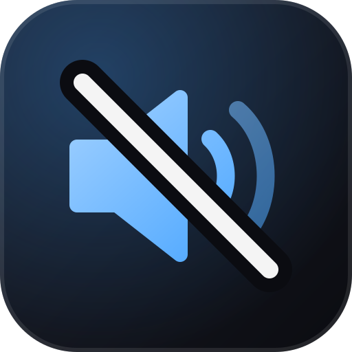

<div align="center">



# win-mute

**Desligue a IA do Windows, a telemetria e o bloatware com um script que dá pra ler.**<br>
Um kit PowerShell para Windows 10 e 11: Copilot, Recall, Cortana, telemetria, serviços desnecessários e apps de fábrica. 72 ajustes, cada um com seu próprio Apply, Revert e Test, e uma GUI de um clique.

[](https://github.com/obrenoalvim/win-mute/releases/latest/download/WinMute.exe)

[](LICENSE)
[](https://github.com/obrenoalvim/win-mute/stargazers)
[](Invoke-WinMute.ps1)
[](#perguntas-frequentes)

[English](README.md) · **Português**

[Como funciona](#como-funciona) · [Uso](#uso) · [Segurança](#você-vai-perder-alguma-coisa) · [Perguntas frequentes](#perguntas-frequentes) · [Adicionando um ajuste](#adicionando-um-ajuste)

</div>

---

Kit PowerShell que desliga IA do Windows (Copilot, Recall, Cortana), telemetria,
serviços/tarefas desnecessárias e programas de fábrica em **Windows 10 ou 11**.
Mesma categoria do O&O ShutUp10++, Sophia Script ou WPD, só que aberto: dá pra
ler o script inteiro do início ao fim antes de rodar, em vez de confiar num
binário fechado.

Duas portas de entrada:

- **GUI** (`Start-WinMuteGui.ps1`, ou clique duplo em `START-GUI.bat`).
  Janela com botão único "Aplicar agora", lista detalhada opcional, pede
  elevação de admin sozinha (prompt de UAC), troca entre PT-BR e EN num
  clique. Pra quem não manja de PowerShell.
- **CLI** (`Invoke-WinMute.ps1`). Flags pra rodar sem prompt, ou um
  seletor `Out-GridView` se rodar sem argumento nenhum. Pra quem já usa
  terminal no dia a dia.

As duas usam as mesmas definições em `modules/` e detectam **Windows 10 ou 11
sozinhas** (pelo número de build). Ajustes que só existem numa das duas
versões (Copilot, Recall, Click To Do, o menu de clique direito clássico,
Widgets, o botão do Copilot na barra de tarefas, Suggested Actions do
clipboard) somem automaticamente na outra. Nada pra escolher na mão.

## Como funciona

Cada ajuste é um objeto PowerShell simples com blocos `Apply`, `Revert` e
`Test`, mexendo exatamente nos mesmos pontos que essas ferramentas mexem:
chaves de registro de Group Policy em `HKLM:\SOFTWARE\Policies\Microsoft\...`,
tipo de inicialização de serviço, tarefas agendadas e remoção de pacote Appx.
Nada de caixa preta: abra `modules/*.ps1` e leia exatamente o que cada um faz
antes de rodar.

72 ajustes em 6 categorias (64 valem no Windows 10, 70 no Windows 11, filtro
automático):

| Categoria | O que cobre |
|---|---|
| `AI` | Copilot, Recall, Click To Do, Cortana, busca do Bing, IA generativa, Destaques de busca, Suggested Actions do clipboard, sugestão do Bing na busca |
| `Telemetry` | Nível de dado de diagnóstico, DiagTrack/dmwappushservice, ID de publicidade, histórico de atividades, CEIP, relatório de erro |
| `Services` | Retail Demo, Maps broker, Fax, indexação da busca, Remote Registry, serviços do Xbox |
| `ScheduledTasks` | CEIP, Application Experience, prompt de feedback, telemetria do autochk, fila do WER |
| `Bloatware` | 25 apps de fábrica (apps do Xbox, Bing Weather/News, Solitaire, Skype, Teams consumer, etc) |
| `Privacy` | Anúncio no Iniciar/tela de bloqueio, seção "Recomendados", menu de clique direito clássico, ícone de Chat na taskbar, ícone de Pessoas (Win10), Widgets, nag do OneDrive, instalação automática de app patrocinado, localização, apps em segundo plano, sync de clipboard na nuvem, gravação do Game Bar, nag de upgrade pro Win11 (Win10), atalho do Edge voltando |

Adicionado depois de duas rodadas de pesquisa sobre o que usuário realmente
reclama do Windows (Reddit e imprensa tech, 2025-2026):

- **Revolta contra o Windows 11**: menu de clique direito capado, anúncio no
  Menu Iniciar, feed "Recomendados" forçado, ícone de Chat na taskbar, app
  patrocinado se instalando sozinho. Virou `PRIV07` a `PRIV11` e `AI08`/`AI09`.
- **Dor específica do Windows 10** (pós fim de suporte, out/2025): nag
  insistente de upgrade pro Windows 11 em quem fica no 10 pra usar ESU, Bing
  sequestrando a caixa de busca da taskbar, ícone de Pessoas que ninguém
  pediu, e o Edge recriando atalho na área de trabalho toda hora. Virou
  `PRIV12` a `PRIV14` e `AI10`.

Uma coisa que **não** mexemos de propósito: reinício forçado e atualização
automática do Windows. Desligar isso troca um incômodo de interface por PC
sem patch de segurança, e essa troca não vale a pena nem no `-All`.

## Uso

### GUI (usuário não técnico)

**[Baixe o WinMute.exe](https://github.com/obrenoalvim/win-mute/releases/latest/download/WinMute.exe)**, um arquivo só, sem instalar nada. Dá dois cliques (o SmartScreen do Windows pode avisar por não ser assinado, clica em "Mais informações" e depois "Executar assim mesmo", é o mesmo código aberto desse repositório, compilado via `build/Build-Exe.ps1`). Ele pede elevação sozinho (prompt de UAC), mostra a versão do Windows detectada no topo, um botão grande "Aplicar agora" com os ajustes seguros recomendados, e uma seção "Personalizar ajustes" (fechada por padrão) com a lista completa agrupada por categoria, cor por risco (verde/laranja/vermelho) e um botão no canto pra trocar entre PT e EN.

Prefere rodar direto do código-fonte em vez do exe? Clique duplo em `START-GUI.bat` (ou rode `Start-WinMuteGui.ps1`) depois de clonar o repositório.

### CLI (usuário avançado)

Rode o PowerShell **como Administrador**.

```powershell
# Lista interativa (Out-GridView), escolhe o que quiser e clica OK
.\Invoke-WinMute.ps1

# Aplica tudo de uma ou mais categorias, sem prompt
.\Invoke-WinMute.ps1 -Categories AI,Telemetry -All

# Aplica só o que não tem nenhum efeito colateral
.\Invoke-WinMute.ps1 -All -SafeOnly

# Aplica ajustes específicos por id
.\Invoke-WinMute.ps1 -Ids AI01,AI02,TEL02

# Mostra o que já está aplicado ou não, ajuste por ajuste
.\Invoke-WinMute.ps1 -Report

# Reverte tudo que essa ferramenta já aplicou
.\Invoke-WinMute.ps1 -Undo

# Pula o ponto de restauração automático (mais rápido, menos seguro)
.\Invoke-WinMute.ps1 -All -SkipRestorePoint
```

Por padrão a ferramenta cria um ponto de restauração antes de qualquer
mudança (a não ser que você passe `-SkipRestorePoint`). Os ids aplicados
ficam registrados em `logs/applied.json`, pra `-Undo` saber o que desfazer.
É um log de *quais* ajustes rodaram, não um diff completo do registro: o
`Revert` de cada ajuste usa um valor fixo de "volta pro padrão do Windows",
o mesmo jeito que Sophia Script e ferramentas parecidas fazem.

## Você vai perder alguma coisa?

Reconferi cada um dos 72 ajustes pensando nisso. Nenhum apaga ou toca em
arquivo pessoal: eles mexem em valor de registro, tipo de inicialização de
serviço, estado de tarefa agendada, ou desinstalam um app da Store (o que
remove só a configuração/cache daquele app, nunca seus Documentos, fotos ou
qualquer coisa fora do app). O ponto de restauração criado antes de rodar é
uma rede de segurança a mais: se algo parecer errado, o próprio System
Restore do Windows volta a máquina inteira pro estado anterior.

- **Seguro**: nenhum efeito colateral pra um uso normal de desktop.
- **Moderado**: desliga algo que você pode realmente usar (indexação da
  busca, Maps, serviços do Xbox, Family Safety, atualização em segundo plano
  de notificação de email/chat).
- **Agressivo**: recurso legado ou caso de borda (Fax).

Remoção de `Bloatware` é desinstalação de verdade: reverter só mostra um
lembrete pra reinstalar pela Microsoft Store, porque o Windows não guarda
cópia local de um app de fábrica removido.

## Perguntas frequentes

**Como desligo o Windows Recall?**
Rode a GUI ou `.\Invoke-WinMute.ps1 -Ids AI02`. Ele ativa a política `DisableAIDataAnalysis`, o Recall para de tirar e guardar foto da tela. Só Windows 11, some sozinho no Windows 10.

**Como desligo o Copilot no Windows 11?**
`.\Invoke-WinMute.ps1 -Ids AI01,AI06` desliga a política do Copilot e esconde o botão da taskbar. Os dois só existem no Windows 11.

**Como paro a telemetria do Windows 10 ou 11?**
`.\Invoke-WinMute.ps1 -Categories Telemetry -All` cobre nível de dado de diagnóstico, serviço DiagTrack, CEIP e relatório de erro de uma vez. Nota: no Windows Home/Pro a Microsoft não deixa a telemetria chegar em zero de verdade, só Enterprise/Education consegue, isso aplica o nível mais baixo que qualquer edição aceita.

**Tem alternativa open source pro O&O ShutUp10++, Sophia Script ou WPD?**
É exatamente isso que o win-mute é: mesma categoria de ferramenta, mesmas alavancas de registro/serviço/tarefa, mas um script que dá pra ler do início ao fim em vez de um binário fechado. Ver [Como funciona](#como-funciona).

**Como removo programa de fábrica tipo Xbox, Solitaire ou os apps do Bing?**
`.\Invoke-WinMute.ps1 -Categories Bloatware -All` desinstala os 25 apps de fábrica rastreados. Cada um é uma desinstalação de verdade da Store, ver [Você vai perder alguma coisa?](#você-vai-perder-alguma-coisa) antes de rodar.

**Funciona no Windows 10 e no Windows 11?**
Sim, detectado sozinho pelo número de build. 64 dos 72 ajustes valem no Windows 10, 70 no Windows 11, sem escolher versão.

## Adicionando um ajuste

Cria um `[PSCustomObject]` novo com `Id`, `Category`, `Risk`, `Name`,
`Description`, `Apply`, `Revert`, `Test` no arquivo certo dentro de
`modules/`. O `Invoke-WinMute.ps1` pega automático, sem passo de
cadastro. Pra aparecer traduzido na GUI, adiciona o mesmo `Id` no dicionário
`$S.pt.tweaks` e `$S.en.tweaks` dentro de `Start-WinMuteGui.ps1`.

## Mais ferramentas Windows do mesmo autor

- [**rigdeck**](https://github.com/obrenoalvim/rigdeck): um Stream Deck sem hardware, controlado pelo celular.
- [**claude-usage-tray**](https://github.com/obrenoalvim/claude-usage-tray): ícone na bandeja com o uso de 5 horas do Claude Code.
- [**echoport**](https://github.com/obrenoalvim/echoport): scanner de portas localhost em tempo real para devs.

## Contribuindo

Conhece um ajuste que o pessoal reclama, ou um que falha na sua build? Abra uma issue ou um PR. Veja o [CONTRIBUTING.pt-BR.md](CONTRIBUTING.pt-BR.md) e o [changelog](CHANGELOG.md).

## Licença

MIT, veja [LICENSE](LICENSE).

---

<div align="center">

Se o win-mute te devolveu o desktop, uma ⭐ ajuda outras pessoas a encontrá-lo.

<sub>**Tópicos:** windows11 · windows10 · copilot · recall · telemetry · debloat · privacy · powershell · windows-tweaks · windows-debloater</sub>

</div>
